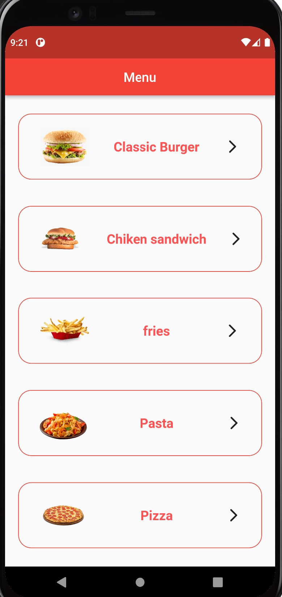
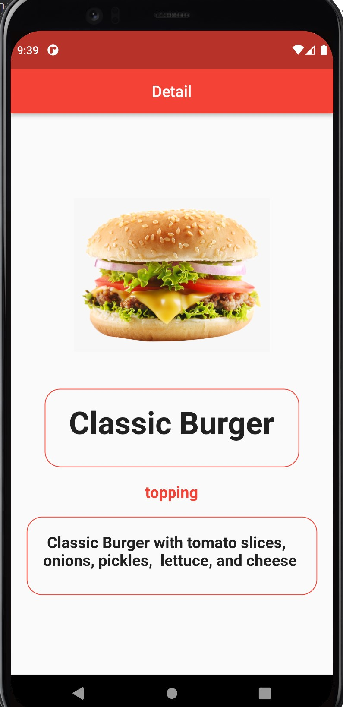

# UC-Flutter-hw-3

قم بصنع برنامج لاحد المطاعم بحيث تعرض قائمة من الاطباق الرئيسية للمطعم و يجب ان يتوفر لكل طبق صفحة تعرض بعض التفاصيل للطبق ( صورة , اسم الطبق , اهم المكونات , السعر) 
> hint:
* نحتاج صفحتين ( Home page تحتوي القائمة - Detail page )
* نحتاج الى (model- provider)
1. اولاً في صفحة  Homepage يتم اضافة listView  
2. ثانياً في صفحة Detail نضيف فيها (Image widget - Text widget 2)
3. نضيف مجلدات  (models- providers) داخل مجلد lib 
4. ننشأ ملف model في مجلد models و بداخله المتغيرات المطلوبة و ايضا نضع بيانات تجريبية للتأكد من صحة عمل البرنامج
5. ننشأ ملف provider في مجلد providers  من خلاله يتم التحكم بالبيانات

